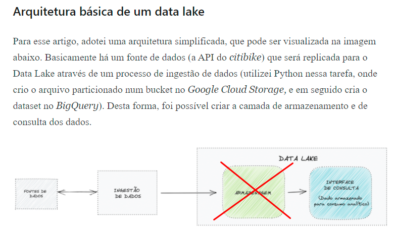
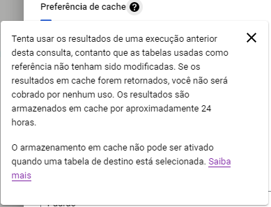
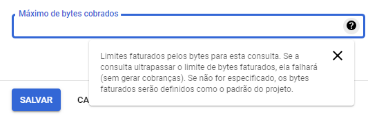

# Gerenciamento Custos BigQuery

## Prática recomendada bigquery

## Estimativa de custos no presente

Minha estimativa de baixo custo pressupõe que não utlizaremos um bucket, ou seja, o armazenamento de dados brutos(raw) não será de nosso gerenciamento. Foi realizado uma conta com mais de 20gb de armazenamento em tabelas próprias do BigQuery, em que serão realizado as consultas, como descrito na imagem abaixo.

## Auditoria de uso de dados

Link que explica como gerenciar o consumo do BigQuery e o consumo das requisições, assim como controle de acesso e desenvolvimento de logs <https://cloud.google.com/bigquery/docs/reference/auditlogs?hl=pt-br>

O Link àbaixo mostra como criar uma view de utilização do bigquery associado à um relatório com custos baseados em consumo x preço e especificando o usuário.
<https://ichi.pro/pt/monitorar-os-custos-do-bigquery-e-o-uso-de-relatorios-com-o-data-studio-201726460156410>

## Utilização do cache

É possível criar tabelas e views com cache, em que os resultados da query serão armazenados em cache, reduzindo tempo de consulta e valor do mesmo.

Não sei como delimitar isso para o Data Studio,visto que sempre será uma consulta nova.

Vantagens do Cache:

* Melhor performance por retornar dados já processados.
* Dados lidos do cache não tem custo.

O cache não será utilizado caso:

* A query não seja uma réplica exata da query original.
* Em caso de alteração nos dados da tabela acessada pela query. Neste caso o cache é invalidado e após nova execução da query um novo cache será criado.
* Tabelas utilizando ingestão de dados por streaming.
* Funções não determinísticas: CURRENT_TIMESTAMP(), CURRENT_USER(), etc.
* Tabelas externas.

## Limitação de Consumo de Querys

Podemos utilizar um modo de limitar os bytes de uma consulta para que não dê gargalo.

Nesses casos a consulta é interrompida e não faturada.

Preciso conferir se há a opção de limitar na API do BigQuery e adicionar à ETL.

